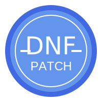

# DNF Patch Manager

一个现代化的DNF（地下城与勇士）补丁管理工具，使用Go语言和Fyne框架开发。



## 功能特点

- 🎮 简单易用的图形界面
- 🔍 智能补丁搜索功能
- ⭐ 补丁评分系统
- 🖼️ 补丁预览图片
- 🔄 补丁更新检查
- 📝 安装历史记录
- 💾 自动备份系统
- 🔒 文件完整性验证

## 安装说明

### 系统要求

- Go 1.16 或更高版本
- 支持的操作系统：Windows

### 从源码构建

1. 克隆仓库：
```bash
git clone https://github.com/yourusername/DNF_Patch.git
cd DNF_Patch
```

2. 安装依赖：
```bash
go mod tidy
```

3. 构建程序：
```bash
go build
```

### 直接下载

访问 [Releases](https://github.com/yourusername/DNF_Patch/releases) 页面下载最新版本。

## 使用说明

1. 启动程序后，选择DNF游戏安装目录
2. 在补丁列表中浏览或搜索想要的补丁
3. 点击补丁查看详细信息和预览图
4. 点击"Import"按钮导入补丁
5. 在历史记录中查看已安装的补丁
6. 使用备份功能管理游戏文件

## 备份功能

- 自动备份：定期自动备份游戏文件
- 手动备份：随时创建备份点
- 版本管理：管理多个备份版本
- 一键还原：快速还原到之前的状态

## 开发计划

- [ ] 补丁冲突检测
- [ ] 在线补丁库
- [ ] 补丁制作工具
- [ ] 多语言支持
- [ ] 自动更新功能

## 贡献指南

欢迎提交 Pull Request 或创建 Issue！

## 许可证

本项目采用 MIT 许可证 - 详见 [LICENSE](LICENSE) 文件
